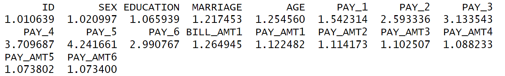

<h1>Credit Card Default Risk Analysis and Prediction</h1>

__Tools used : R Programming (Logistic Regression, CART)__

__Business Problem Scenario__
-------
In an increasingly competitive market, banks are under pressure to attract and retain customers by offering credit card products with attractive terms and rewards. However, the allure of credit comes with inherent risks, particularly in times of economic volatility or changing consumer behavior. The ability to effectively assess and manage these risks is crucial for maintaining the bank's financial stability and competitive edge.

__Proposed Solution__
To address this challenge, I will leverage on advanced analytics and statistical modeling using R proves to be a strategic solution. Specifically, Logistic Regression and Classification and Regression Trees (CART) in R enable a comprehensive evaluation of the likelihood of credit card default among customers. 

__Exploratory Data Analysis and Preparation__

+ Check the data for any duplicates, missing values and datatypes of the variables

Findings: There are no duplicates or missing values. All the variables are all numeric data types. However variables such as SEX, EDUCATION, MARRIAGE, PAY_0, PAY_2, PAY_3, PAY_4, PAY_5, PAY_6, default_payment_next_month are categorical features. So we have to convert these features in categorical.

+ Check whether dataset is balanced.

div align="left">

Findings: I discovered that the data is highly unbalanced. Approximately 77% of the data is non default while only around 22% of the data is classified as default. These would lead to a relatively high baseline accuracy and potentially mislead the predictive model. In order to avoid this issue, I decided to undersample the dataset for the trainset later on to make sure default and non-default creditors are take approximately the same weights, which could ensure the effectiveness of the predictive models. 

+ Exploring the relationships between the different different features and target variable (default.payment.next.month)

Findings: The graph has a right skewed distribution. The number of clients defaulting the payment next month decreases as age increases. Thus age is a crucial feature to predict the default payment for next month.

Findings: From the above plot, it can inferred that married people between the age of 30-50 and unmarried peope of age 20-30 have a tendency to default payment. Moreover, unmarried clients have a higher proability to default compared to married clients. 

Findings: From the graph, females of age 20-30 have a higher tendency to default payment compared to males in all age groups. 

__Logistic regression__

Here, I used the ovun.sample to undersample the trainset such that the number of non-default payment is equal to default payment to make the data balanced.

Here, I used the vif function to check for multicollinearity. General rule of thumb, VIF value of >5 signifies severe multicollinearity which can lead to unstable estimates of the regression coefficients, making it challenging to interpret the individual effects of predictors on the response variable. As seen from the VIF values, there are BILL_AMT have very high VIF values.

</div
                                                             
After removing the variable BILL_AMT except BILL_AMT1 as it is slightly significant and all the VIF values are <5. Hence the above are the final variables used to train the logistic model 

To evaluate the Logistic Regression Model, I calculated RMSE and the absolute error. A lower RMSE indicates better model performance.The summary statistics of the absolute residuals (differences between predicted and actual values) provide additional insights into the distribution of errors in the training set. However the RMSE of the test set is slightly lower than the RMSE trainset. The summary of absolute residuals also shows that the median and mean values are higher for the training set compared to the test set. These observations suggest that there might be a slight overfitting, as the model is performing better on the training data than on the test data. However, the difference is not extreme, and the model seems to generalize reasonably well to the test set. The reason may be due to insufficent data as well due to low default cases in the data set. 

Based on the confusion matrix, the accuracy of the model is approximately 80.57%, indicating that the model is accurate in predicting both classes. Sensitivity (True Positive Rate): 0.9127 - This indicates the proportion of actual positives correctly predicted by the model. Specificity (True Negative Rate): 0.4289 - This represents the proportion of actual negatives correctly predicted by the model. A lower specificity may indicate a higher rate of false positives. Considering the nature of predicting default payments (class 1), it's crucial to have a high sensitivity to correctly identify customers at risk of default.  However, the specificity is lower (0.4289), indicating a higher rate of false positives.

__Decision Tree Analysis (CART Model)__

Besides logistic regression, I decided to use CART Model to make a comparision beteween both models to see which is better in accessing and predicting the risk for default payment. I plotted the optimal tree for the dataset and I noticed that BILLAMT1 is a significant variable this supports not removing the variable in logisitic regression analysis. 

__Evaluation Decision Tree Analysis (CART Model)__

To evaluate the CART model, I calculated the RMSE. The RMSE of the CART model is lower compared to the RMSE of logistic regression model, this suggests that the CART model performs better in terms of predictive accuracy on the given dataset.

Based on the confusion matrix, the overall accuracy of the model is around 76.01%. Thus indicating that 76.01% of the predictions are correct. Sensitivity (True Positive Rate): The sensitivity is 81.42%, suggesting that the model correctly identifies about 81.42% of the instances where the true class is 1 (default). Specificity (True Negative Rate): The specificity is 56.96%, indicating that the model correctly identifies about 56.96% of the instances where the true class is 0 (non-default). Overall, the evaluation metrics suggest a moderate performance of the CART model in predicting class 1 (default). It correctly identifies a significant portion of true negative (default payment) 

__Evaluation between Logistic Regression and Decision Tree Analysis (CART Model)__
While Decision Tree Analysis has a lower RMSE and higher specificity rate compared to the logistic model thus the CART Model will be better in predicting and accessing the risk of clients defaulting payments 

__Insights from modeling__
The cart model provides insights into the important features affecting credit default. Notably the repayment status from July to September emerge as crucial predictors.This aligns with the intuitive understanding that an increasing delay in repayments raises the likelihood of credit default, and conversely, prompt repayments reduce this risk.
Additionally credit limit(limit_bal) and bill amount in September(BILLAMT1) are identified as significant predictors. This is line with having higher credit limit usually suggests a more affluent environment, contributing to a lower risk of credit default. Similary, people with higher bill amount in september are more likely to default in next month payment since it signals financial stress or challenges in managing expenses, making it a key predictor of potential default. Additionally, age and whether people are married are identified as predictors as well. Age signifies a potential correlation, as older individuals may have accumulated more resources and place a higher value on their reputation, reducing the likelihood of credit default. Individuals who are married tend to exhibit a lower likelihood of defaulting on payments, and this phenomenon can be attributed to several factors. Marriage often brings about shared financial responsibilities and a joint commitment to managing household finances. The presence of a partner can create a support system that encourages responsible financial behavior, as couples typically collaborate on budgeting, savings, and making major financial decisions.

__Reflection__
An essential avenue for enhancing the predictive model lies in augmenting the data source to incorporate additional critical information currently absent from the dataset. Notably, aspects such as the present economic conditions of individual creditors, encompassing factors like incomes and employment status, as well as the valuation of non-liquid assets owned by creditors, remain unaccounted for. The inherent limitations of the existing dataset contribute to a reduction in the predictive power of the model and introduce increased uncertainty.
